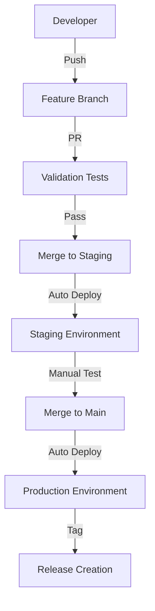

# DevOps Guide - RustDesk Deployment Pipeline

Complete guide for managing the RustDesk deployment pipeline with GitHub Actions, multi-environment strategy, and best practices.

## 🏗️ **Architecture Overview**

### **Pipeline Flow**


### **Environment Strategy**
- **Staging**: Testing and validation environment
- **Production**: Live RustDesk service
- **Feature Branches**: Development and testing
- **Main Branch**: Production-ready code

## 🔧 **GitHub Actions Workflows**

### **1. deploy-components.yml**
**Purpose**: Automated deployment to staging and production

**Triggers**:
- Push to `main` branch → Production deployment
- Push to `staging` branch → Staging deployment
- Manual workflow dispatch → Choose environment

**Key Steps**:
1. **Validation**: Script syntax, JSON validation, security checks
2. **Environment Setup**: AWS credentials, bucket selection
3. **Component Deployment**: Upload to S3, CloudFormation update
4. **Verification**: Component count, accessibility tests
5. **Notification**: Success/failure notifications

**Environment Variables**:
```yaml
# Automatically set based on branch
BUCKET_NAME: ${{ vars.STAGING_S3_BUCKET || vars.PROD_S3_BUCKET }}
ENVIRONMENT: staging || prod
AWS_REGION: ${{ vars.AWS_REGION }}
```

### **2. test-scripts.yml**
**Purpose**: Comprehensive validation and testing

**Triggers**:
- Pull requests to `main` or `staging`
- Push to any branch

**Validation Steps**:
- **ShellCheck**: Shell script linting and best practices
- **Python Syntax**: Compilation and basic linting
- **JSON Validation**: Configuration file structure
- **Security Scan**: Secret detection, vulnerability scanning
- **Component Count**: Ensure all required files present
- **File Permissions**: Executable bits set correctly

### **3. release.yml**
**Purpose**: Production release management

**Triggers**:
- Git tags matching `v*` pattern
- Manual workflow dispatch with version input

**Release Process**:
1. **Validation**: Full component validation
2. **Changelog Generation**: Auto-generate from git commits
3. **Package Creation**: Create downloadable archives
4. **Production Deployment**: Deploy to production S3
5. **GitHub Release**: Create release with assets
6. **Backup Creation**: Store versioned backup in S3

## 🌍 **Environment Configuration**

### **Staging Environment**
```json
{
  "name": "staging",
  "s3_bucket": "rustdesk-staging",
  "instance_type": "t3a.micro",
  "ssl_enabled": true,
  "domain": "danyel-remote.com",
  "alert_cooldown": 5,
  "monitoring": true,
  "note": "Shares domain with production - only one can be active at a time"
}
```

### **Production Environment**
```json
{
  "name": "prod",
  "s3_bucket": "rustdesk-s3-bak",
  "instance_type": "t3a.micro",
  "ssl_enabled": true,
  "domain": "danyel-remote.com",
  "alert_cooldown": 15,
  "monitoring": true
}
```

## 🔐 **Security & Secrets Management**

### **GitHub Secrets**
- **AWS_ACCESS_KEY_ID**: AWS programmatic access
- **AWS_SECRET_ACCESS_KEY**: AWS secret key
- **GITHUB_TOKEN**: Auto-generated for releases

### **GitHub Variables**
- **AWS_REGION**: `il-central-1`
- **STAGING_S3_BUCKET**: `rustdesk-staging`
- **PROD_S3_BUCKET**: `rustdesk-s3-bak`

### **AWS Secrets Manager**
- **Production**: `rustdesk/email-password`
- **Staging**: `rustdesk/staging/email-password`

### **Security Best Practices**
- ✅ **No secrets in code**: All credentials externalized
- ✅ **Least privilege**: Minimal required permissions
- ✅ **Encrypted storage**: S3 server-side encryption
- ✅ **Audit trail**: All actions logged and tracked
- ✅ **Access control**: Branch protection rules

## 📊 **Monitoring & Observability**

### **GitHub Actions Monitoring**
- **Workflow Status**: Success/failure notifications
- **Deployment History**: Complete audit trail
- **Performance Metrics**: Build times, component counts
- **Error Tracking**: Failed deployments with logs

### **Application Monitoring**
- **Health Checks**: Component availability validation
- **Performance Metrics**: Deployment time tracking
- **Security Scanning**: Vulnerability detection
- **Compliance Checks**: Configuration validation

### **Alerting Strategy**
```yaml
# Notification channels
- GitHub Issues (workflow failures)
- Email alerts (deployment status)
- Slack integration (optional)
- AWS CloudWatch (infrastructure alerts)
```

## 🚀 **Deployment Strategies**

### **Standard Deployment**
1. **Development**: Feature branches for new work
2. **Integration**: Merge to staging for testing
3. **Validation**: Automated and manual testing
4. **Production**: Merge staging to main
5. **Release**: Tag for versioned releases

### **Hotfix Deployment**
1. **Create hotfix branch** from main
2. **Apply critical fix**
3. **Direct merge to main** (bypass staging for urgency)
4. **Merge back to staging** to keep environments in sync
5. **Tag release** with hotfix version

### **Rollback Procedure**
```bash
# Option 1: Revert commit
git revert <commit-hash>
git push origin main

# Option 2: Redeploy previous tag
git checkout <previous-tag>
git tag -f <current-tag>
git push origin <current-tag> --force

# Option 3: Manual S3 restore
aws s3 sync s3://bucket/Releases/v1.2.0/ s3://bucket/Components/
```

## 🧪 **Testing Strategy**

### **Automated Testing**
- **Unit Tests**: Individual component validation
- **Integration Tests**: Multi-component interaction
- **Security Tests**: Vulnerability and secret scanning
- **Performance Tests**: Deployment speed and reliability

### **Manual Testing Checklist**
```markdown
#### Staging Validation
- [ ] Bootstrap script downloads all components
- [ ] All systemd services start correctly
- [ ] Web dashboard accessible
- [ ] Monitoring alerts functional
- [ ] Backup process works
- [ ] Email notifications sent

#### Production Validation
- [ ] SSL certificate valid
- [ ] Domain resolution correct
- [ ] RustDesk client connectivity
- [ ] Performance metrics normal
- [ ] All security features active
```

### **Manual Testing Commands**
```bash
# Test staging/production deployment (same domain)
curl https://danyel-remote.com/monitoring

# Check RustDesk connectivity
telnet danyel-remote.com 21116
telnet danyel-remote.com 21117

# Test SSL certificate
openssl s_client -connect danyel-remote.com:443 -servername danyel-remote.com

# Verify which environment is active
curl https://danyel-remote.com/monitoring | grep -i "staging\|production\|environment"
```

### **Test Environments**
- **Local**: Developer testing with docker-compose
- **Staging**: Full AWS environment for integration testing
- **Production**: Live environment with monitoring

## 📈 **Performance Optimization**

### **Build Optimization**
- **Parallel Processing**: Multiple validation jobs
- **Caching**: GitHub Actions cache for dependencies
- **Minimal Transfers**: Only upload changed components
- **Compression**: Efficient artifact packaging

### **Deployment Speed**
- **Component Versioning**: Skip unchanged components
- **Incremental Updates**: Delta-based deployments
- **Health Checks**: Fast validation methods
- **Rollback Speed**: Quick reversion mechanisms

## 🔄 **Maintenance Procedures**

### **Regular Maintenance**
- **Weekly**: Review deployment metrics and logs
- **Monthly**: Update dependencies and security patches
- **Quarterly**: Security audit and penetration testing
- **Annually**: Infrastructure cost optimization review

### **Component Updates**
```bash
# Update individual component
1. Modify component in appropriate folder
2. Test locally if possible
3. Push to staging branch
4. Validate in staging environment
5. Merge to main for production
```

### **Infrastructure Updates**
```bash
# CloudFormation template updates
1. Update template-docker-enhanced.yaml
2. Update environment-specific parameters
3. Test in staging with new stack
4. Apply to production with stack update
```

## 🆘 **Troubleshooting Guide**

### **Common Issues**

#### **Workflow Failures**
```bash
# Check logs in GitHub Actions
# Common causes:
- AWS permission issues
- S3 bucket access problems
- Component validation failures
- Network connectivity issues
```

#### **Deployment Failures**
```bash
# Check CloudFormation events
# Common causes:
- Parameter validation errors
- Resource limit exceeded
- Network configuration issues
- Security group problems
```

#### **Component Issues**
```bash
# Validate components locally
shellcheck components/scripts/*.sh
python3 -m py_compile components/scripts/*.py
python3 -m json.tool components/configs/*.json
```

### **Debugging Steps**
1. **Check GitHub Actions logs** for pipeline failures
2. **Verify AWS permissions** for deployment account
3. **Test S3 connectivity** from deployment environment
4. **Validate component syntax** before deployment
5. **Check CloudFormation events** for infrastructure issues

### **Recovery Procedures**
```bash
# Emergency rollback
git revert HEAD --no-edit
git push origin main

# Component-specific fix
aws s3 cp fixed-component.sh s3://bucket/Components/
# Restart affected services on EC2
```

## 📚 **Best Practices**

### **Development**
- **Atomic commits**: One logical change per commit
- **Descriptive messages**: Clear commit descriptions
- **Feature branches**: Isolate development work
- **Pull requests**: Code review for all changes
- **Testing**: Validate changes before merge

### **Operations**
- **Monitoring**: Comprehensive observability
- **Documentation**: Keep guides updated
- **Automation**: Minimize manual interventions
- **Security**: Regular security assessments
- **Backup**: Regular and tested backups

### **Security**
- **Principle of least privilege**: Minimal required access
- **Regular rotation**: Periodic credential updates
- **Audit trail**: Complete change tracking
- **Vulnerability management**: Regular security scanning
- **Incident response**: Prepared response procedures

## 🎯 **Success Metrics**

### **Deployment Metrics**
- **Deployment Frequency**: Target daily deployments to staging
- **Lead Time**: < 30 minutes from commit to production
- **Failure Rate**: < 5% deployment failures
- **Recovery Time**: < 15 minutes for rollbacks

### **Quality Metrics**
- **Test Coverage**: 100% component validation
- **Security Scanning**: Zero high-severity vulnerabilities
- **Documentation**: Up-to-date operational guides
- **Automation**: 95%+ automated deployment process

---

**This guide provides the foundation for operating a professional DevOps pipeline. Regular reviews and updates ensure continued effectiveness and security.**